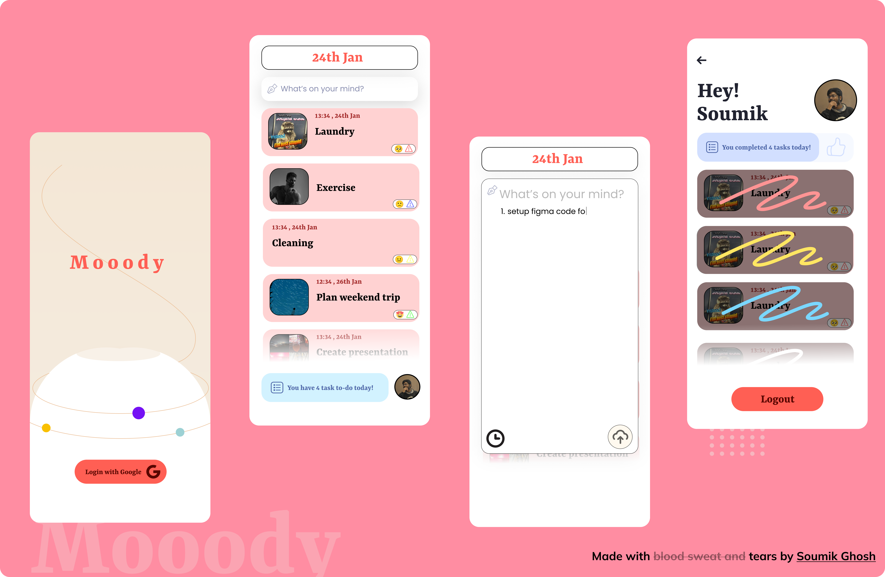

This is a [Next.js](https://nextjs.org/) + [Tailwind css](https://tailwindcss.com/) project bootstrapped with [`create-next-app`](https://github.com/vercel/next.js/tree/canary/packages/create-next-app).

## Getting Started

First, run the development server:

```bash
npm run dev
# or
yarn dev
# or
pnpm dev
```

Open [http://localhost:3000](http://localhost:3000) with your browser to see the result.

You can start editing the page by modifying `pages/index.js`. The page auto-updates as you edit the file.

<!-- write a description of mooody below-->
## [mooody.fun](http://mooody.fun/)

Mooody is a todo list app that allows users to create, edit, and delete tasks. Users can also mark tasks as complete and filter tasks by status. Each task has a mood associated with it, which is determined text sentiment. The mood is displayed as a color on the task card and also a criticality of the task.

## Screenshots


[Figma](https://www.figma.com/file/aMyfIybIU8Nbj8PPBJIFlS/Foxlearn?node-id=0%3A1&t=ky3HWMrDSvYJzRS5-1)